**セキュア認証アプリケーション** 
---
1. プロジェクト概要 
本プロジェクトは、Next.js 15 を使用した「ガチガチにセキュアな設計」のセッションベース認証アプリケーションです。
---
2. 実行環境・技術スタック 
フレームワーク: Next.js 15 (App Router / TypeScript) 
データベース: SQLite (Prisma 6系) 
認証方式: セッションベース認証 (Cookie管理) 
主要ライブラリ: 
     - bcrypt: パスワードの安全なハッシュ化
     - swr: CAPTCHAデータの効率的な取得と更新（連鎖レンダリング防止）
     - lucide-react: セキュリティ意識を高める視覚的UIアイコン
---
3. 実装した独自機能 
① パスワードの強度機能
- パスワード強度判定 & リアルタイムアドバイス: 長さ（8文字以上必須）と文字種（大文字・数字・記号）を評価。脆弱な場合は登録をブロックし、具体的な改善アドバイスを表示します。
- パスワード表示切り替え: 入力ミスを防ぐため、目のアイコンで平文と伏せ字を切り替え可能です。
<table>
  <tr>
    <td>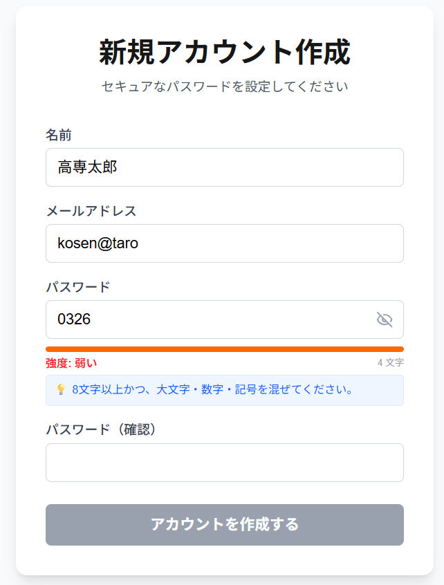</td>
    <td>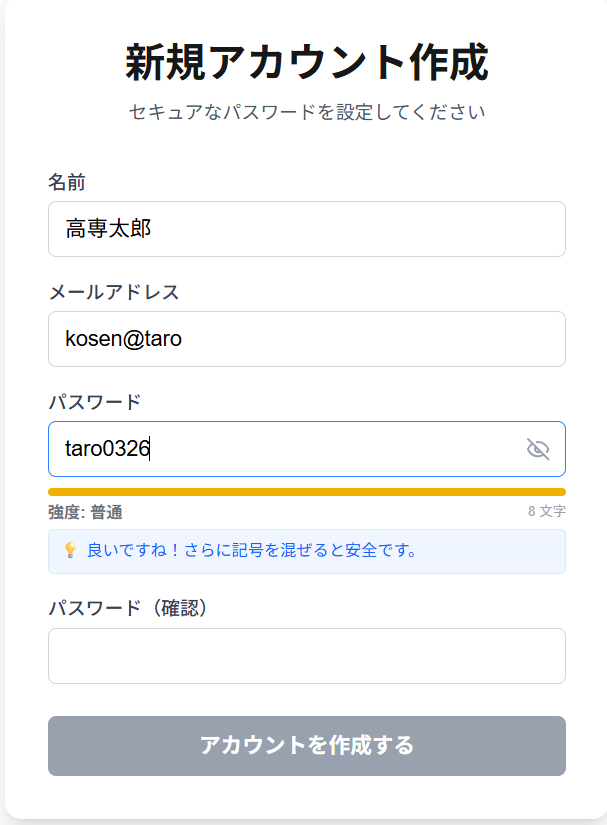</td>
    <td>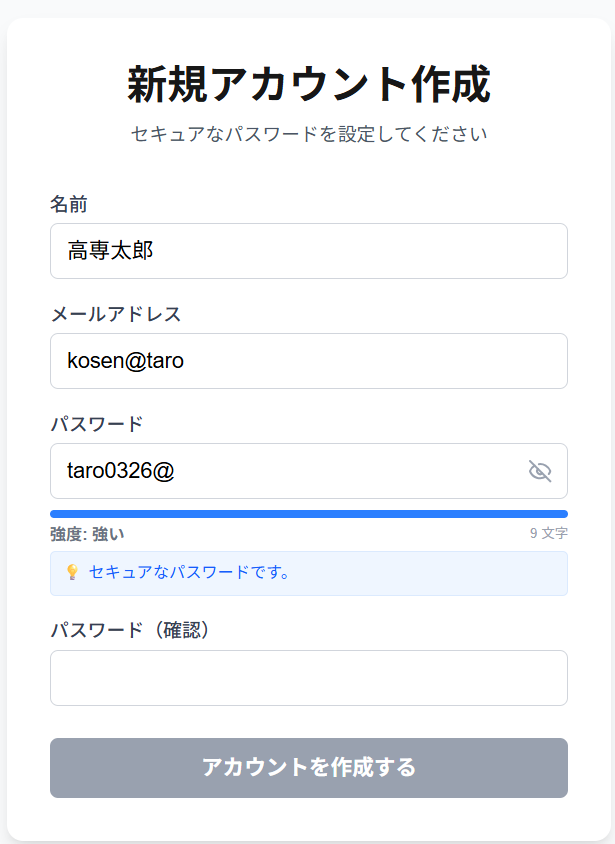</td>
    <td>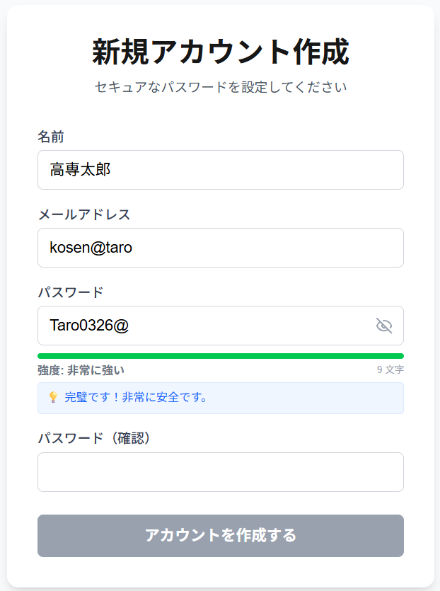</td>
  </tr>
</table>

② 確認パスワード機能
- 確認用パスワード: 入力ミスを防ぐための不一致チェックを行っています。また、二つのパスワードが一致しないとアカウント作成できないようにしています。
<table>
  <tr>
    <td>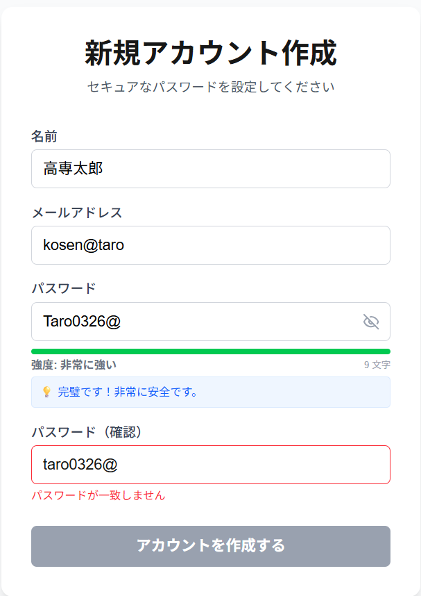</td>
    <td>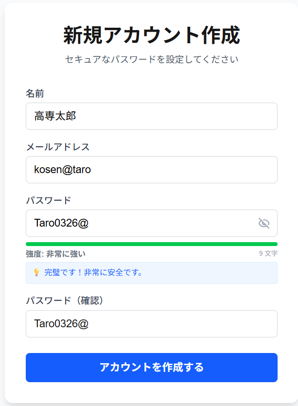</td>
  </tr>
</table>

③ 防御：Bot・ブルートフォース攻撃対策
- CAPTCHA: HMAC署名を用いた計算クイズ。Botによる自動送信を物理的に遮断します。
- レートリミット（ログイン試行制限）: 同一IPからの失敗が15分以内に5回に達した場合、アクセスを一時ロックします。
<table>
  <tr>
    <td>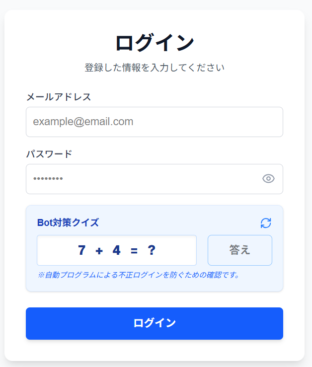</td>
    <td>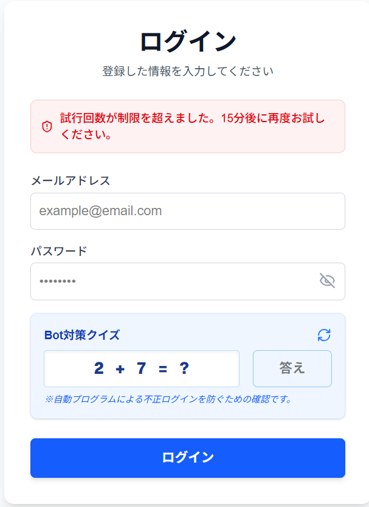</td>
  </tr>
</table>

➃ 遠隔ログアウト機能
- データベース（Sessionテーブル）で管理されている各セッションの端末情報（User-Agent）やIPアドレスをダッシュボードに表示します。これにより、ログイン中の全端末を把握できるだけでなく、紛失した端末やログアウトし忘れた古いセッションを、現在操作中のデバイスから安全に切り離す（遠隔ログアウト）ことができる。
<table>
  <tr>
    <td>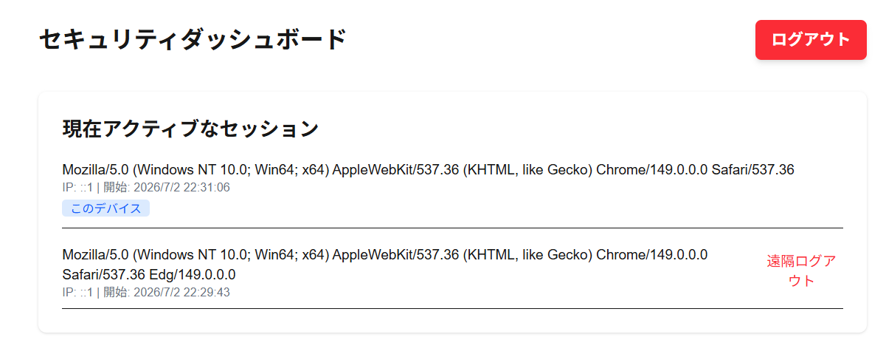</td>
  </tr>
</table>

4. セキュリティ上の工夫（ガチガチな設計）
- パスワードのハッシュ化: bcrypt を使用し、ソルト付きハッシュとして保存。万一のDB漏洩時も元のパスワードは解読不能です。
- セキュアCookie属性: httpOnly, secure, sameSite: "strict" を設定。XSSによるトークン窃取やCSRF攻撃を防止します。
- 厳格なCSP設定: next.config.ts にて Content Security Policy を定義し、不正な外部リソース読み込みを制限しています。
<table>
  <tr>
    <td>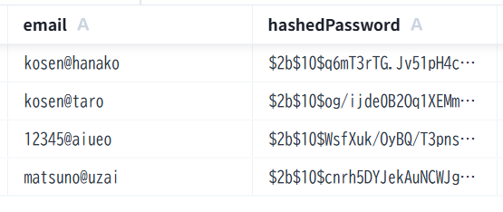</td>
    <td>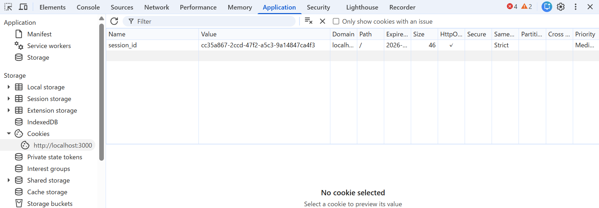</td>
  </tr>
</table>

- 取組時間：約10時間
